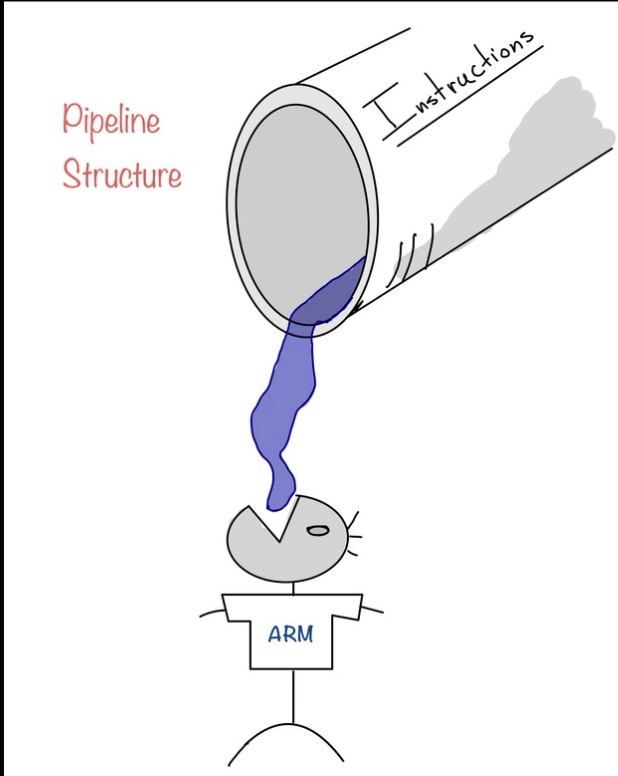
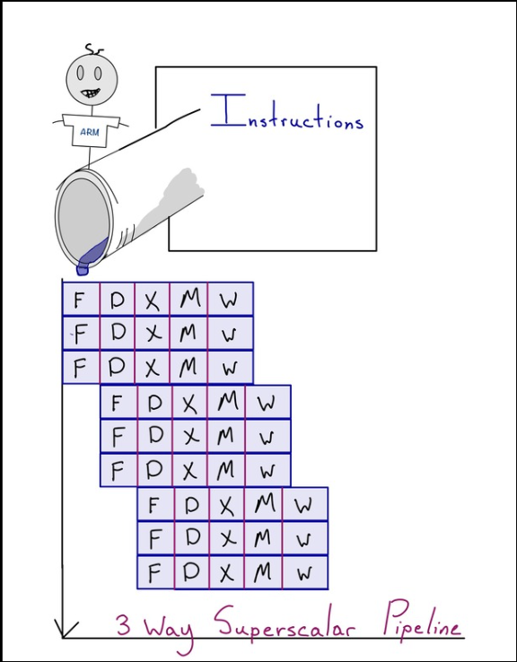
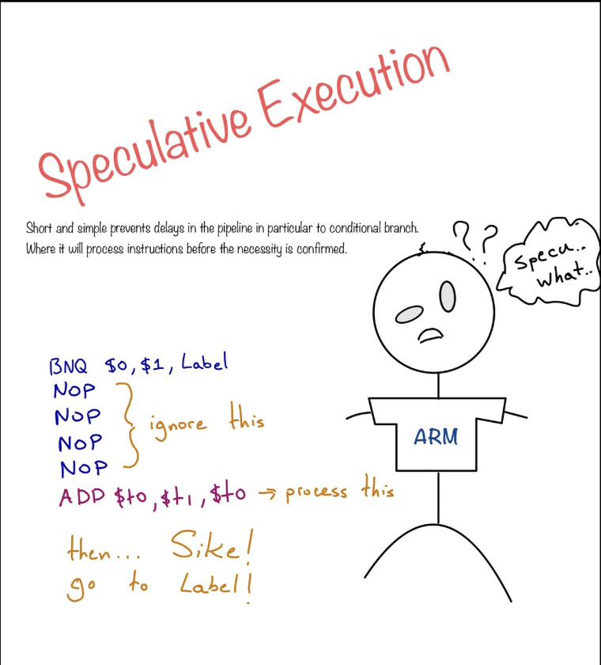
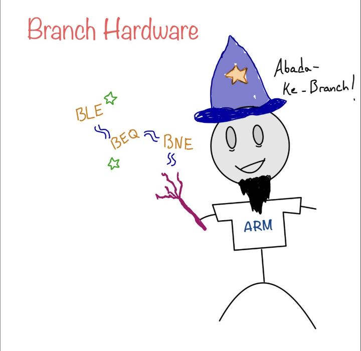
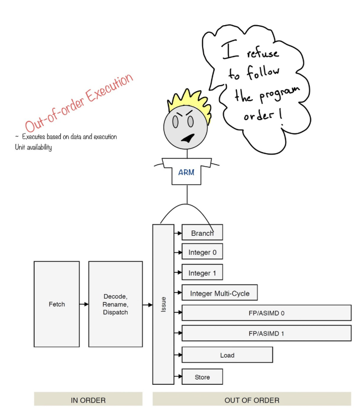

If I had to tell anyone about an experience during my time in college where I truly felt like a Computer Engineer, this would have to be it. Not necessarily because the project itself involved designing and applying what we learned in class... but more because of the issues, confusion, and horror I went through just trying to figure out what we were supposed to do.

Let me give some background so we can relate a bit. This project started with a 50-page PDF, five different files describing instructions, and a ton of reading that felt completely alien to me. The lab was proctored by a TA—who, mind you, wasn’t even a Computer or Electrical Engineer. I remember asking for help and seeing the TA’s utterly confused face. They just said:

> "I have no idea what to do or how to start this..."

Imagine my concern... This was literally the final project for my Computer Architecture class and the TA had _no clue_. I tried to make sense of the task. At the time, I wasn’t terribly comfortable with SystemVerilog either. I found issues with the logic and the instructions in the PDF. When I challenged the TA about them, they shrugged and told me:

> "Just put the wrong answer."

Yeah... that's not a very engineering mentality. I ignored that advice.

### Problems in the Instructions

The first issue I found? We were asked to implement an instruction that added two numbers. The PDF example said `1 + 3 = 10`. I'm sorry... what?

At that point, I knew something was seriously off. I brought these inconsistencies to the professor’s office hours, and thankfully, they agreed that the material seemed incorrect. They told me to just focus on what I _could_ get done.

A lot of my peers gave up and just made an adder. But the actual task was to implement a 5-stage processor that could execute specific instructions.

I took the professor’s words as a challenge: _"make it happen."_

What followed were three beautiful weeks of sleep deprivation, stress until 4am, and me pulling my hair out trying to understand how to make a pipeline from scratch.

### Figuring Out Pipelines

Instead of starting with code, I began drawing and reading to understand what a pipeline _actually_ was.

  

To me, a pipeline became a sequence of steps in a guided order. Instructions move through each stage until they reach completion—each stage working concurrently.

  

I focused on the architecture first. I knew about the five stages, but that alone doesn’t make you ready to take on the project. I also had to simulate instruction flow without RAM or cache in EDAPlayground. So I turned my testbench into a pseudo-memory, storing a fixed sequence of instructions.

Next question: what’s in an instruction?

I started small—with three instructions: `ADD`, `LOAD`, and `BRANCH`. Each had a different format. I started with the op-code and identified what components were needed for each. ADD needed a 16-bit format with op-code, reg1, reg2, etc. Funny enough, I ended up building the testbench before I wrote any pipeline code.

One of my professors once said:

> "Start with testing!"

It sounded weird at first—testing something before writing it—but it became an anchor for the entire project.

### Hazards, NOPs, and Logic

  

Once I had my formats down, I had to tackle hazards. For example, a `BRANCH` could interfere with following instructions. The typical fix we learned in class was to inject `NOPs`—introducing bubbles into the pipeline.

  

By handling branching logic early, I made it easier to scale to `CBZ`, `BL`, and other types later. But let’s be honest—none of it was easy.

I had _zero_ experience using `struct` or `package` in SystemVerilog. So, I did what any desperate engineering student does...

> TO YOUTUBE ACADEMY!!!

I watched dozens of videos. My secret strategy? Pick the ones where the instructor’s accent was so thick I couldn’t understand them at first. Somehow, those always turned out to be the best ones 😂.

  

---

### What I Learned (and What Broke)

One goal I had was to implement **out-of-order execution**. While I didn't get to that due to time constraints, I still see it as a future expansion.

Even though this project was messy, painful, and stressful, I created something. It wasn't perfect, it wasn't groundbreaking—but it was mine.

Funny part? I got marked down for doing it **correctly** because my TA had an outdated answer key. I challenged the grade, went to the professor, and showed all my work. Their reaction?

> "Wait... the TA marked you wrong?"

Turns out, the TA had never taken the course and was randomly assigned. 😬

---

In the end, I got full marks and the course material was revamped for future students. I learned more through this chaos than any other class in college.

---
