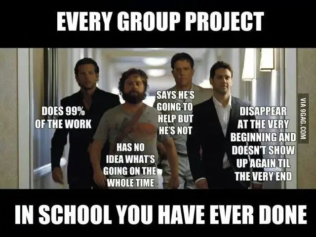

## Introduction

What is the ideal engineer? Someone who is self-motivated, creative, flexible, innovative, and above all, a great communicator who can work well with others. Because in reality, nothing in engineering gets done alone.

But how do we foster teamwork and communication in a field where studying alone until 4 a.m. is the norm? Where weekends are spent grinding through 40-hour homework assignments while friends are out enjoying life, and where the final result is often wrong despite all that effort? I found an unlikely fix to this problem, but more on that later.

Take a second and imagine an engineering student...

Let me guess—you probably thought of a smart person who spends more time at a computer or solving math equations than outside touching grass. Probably a little bit nerdy and sometimes hard to understand and communicate with.

You're not really wrong. Engineering students have their own terminologies and lingo they've picked up over the years in college, and often their humor revolves around their field and the trauma from class. It's so bad that they make us take speech classes and do a ton of writing just so we learn the importance of communicating with others outside our field.

But how effective is it, really, to learn speaking skills from a single semester? Or how well can we truly say we work as a team when we only do one project together, and often one person tries to get all the work done themselves, barely communicating with the rest of the group? Can school really foster the concept of engineers working as a cohesive team with people from different backgrounds and fields?

**Short answer:** No. Just absolutely no.

Let me explain. While in school, you meet all kinds of engineers—some of them extremely talented and smart—but terrible to work with. No communication, no planning, they want to do everything alone, lack social skills, and overall make it a dreadful experience.

If my word isn't enough, you should see how some of them behave at a career fair. It's so bad that during the preparation meetings before the career fair, all the employers say the same thing:  
_"We don't just want someone smart, we need someone who can communicate and work with others."_

Want to know what one of the engineers at that meeting responded to that?  
_"What if we're so smart that we can do it alone?"_

Seriously, this is really the mentality of some engineering students.

Something 90% of the engineers in my classes hated was group projects and presentations. The idea of having to work with others and communicate was simply not desirable for most students. It doesn’t help that some genuinely struggle with social skills.

I could probably tell a hundred stories of group project nightmares, from a member disappearing for five weeks, only to show up at the last moment with the excuse that his car broke down. When we asked why he didn't contact us or answer his phone, he just shrugged and said he forgot.

Or the time someone promised to complete a critical part of the project, disappeared for weeks, and finally sent us something completely useless at the last minute, simply saying, _"I didn't have time."_

Then there are the worst ones—the ones who refuse to communicate at all. You try to pick up your share, but they shut you down with, _"I did it all. Can you just write the report? I hate writing..."_

These skills are difficult to teach in a normal educational setting, but I found an unlikely solution to this problem—partner dance.

## Why Partner Dance?

There are different types of partner dancing, ranging from competitive to social, but they all share similar principles. In most cases, there are two primary roles: **Lead** and **Follow**. Each has unique responsibilities, but more on that later.

Dance is a vulnerable space where you're constantly confronted with reality. There’s no way to hide how you dance—no ChatGPT to refine your movements, no quick fix for poor technique. We all start bad, and that will be visible. You'll be an open book, and everyone in the room will know your ability, or lack thereof. You simply have to learn to be okay with that.

Then there’s the challenge of the partner relationship. Trust me, this is possibly the most difficult part of partner dance. Everyone has different personalities, reacts differently to competitions and stress, and performs differently depending on the situation. It’s very easy to upset a partner, and that's just a reality of dance. If you miss practice and don’t let your partner know, you’ll suffer the consequences of an upset partner. If you didn’t prepare properly for a competition while your partner did, or worse, if you weren’t listening during a dance and accidentally dropped them, expect conflict.

So much can go wrong, and it often leads to arguments, hurt feelings, or even partnerships ending altogether. This is especially true for younger dancers who haven’t yet learned how to self-manage. They tend to be more competitive and can place enormous pressure on their partners.

But this is also where the real lessons begin. Dance teaches responsibility, accountability, and communication. It forces you to stick to deadlines, set realistic goals, and communicate openly with your partner.

#### **Teaching Dance: A Different Kind of Communication**

Developing physical skills in dance is honestly the easy part. The harder part is learning to communicate those skills to others. Teaching dance is a completely different skill set. While you might be a great dancer, a dance teacher is no different than a person delivering a technical presentation to a large group.

You can’t just stand in front of the class, put up a PowerPoint, and talk. In dance, you have to watch your students, explain the task, demonstrate the “algorithm,” have them recreate it, give feedback, and then repeat. Sometimes this means watching 30+ students dance simultaneously and making mental notes in real-time. It also means adapting your feedback to each student, because unlike in a classroom where textbooks and formulas are available, dance instruction demands creativity. You have to create analogies, draw on life experiences, and even get to know your students on a personal level to understand how they process feedback.

#### **Connecting the Dots to Engineering**

Where does engineering come into play? These are all skills that an engineer absolutely needs—management, clear communication, teamwork, and adaptability when faced with unexpected challenges.

These are lessons you can learn through dance. Unlike a public speaking class or a writing-intensive course, where a grade holds the overall value, the implications in dance are more personal. Mess up enough, and your dance partners will simply refuse to work with you.

I knew a student who was a PhD candidate in Mechanical Engineering. Surprisingly, his lack of social skills eventually made it so that all his partners rejected dancing with him after just two months. Some of the issues he struggled with included:

- **Perfectionism:** Expecting his partners to be flawless while refusing to accept his own mistakes.
- **Micromanagement:** Constantly correcting his partners, often without considering their comfort or confidence.
- **Tone Issues:** Demanding that his partners change their tone while he continued making fundamental errors.
- **Arrogance:** Assuming he was always right, even when his technique clearly needed improvement.
- **Poor Emotional Control:** Yelling at partners, reacting badly to criticism, and generally making practices unpleasant.

Eventually, no one wanted to dance with him. It didn’t help that he was stubborn and felt like changing wasn’t necessary. This is a harsh but valuable lesson—if you don’t develop social skills and learn to work well with others, you’ll find yourself isolated, both in dance and in your career. It’s better to learn this lesson in a dance studio than at a job.

Personally dance isnt very far from concepts in engineering, I love using physics and engineering principles when thinking about dance. For example, partner dance in ballroom Latin often simulates an inelastic collision, where two bodies connect and move as one, transferring momentum while maintaining stability. This is a fun way to think about dance and creates great teaching analogies when explaining concepts to engineers.

Ultimately, dance, like engineering, is about problem-solving, real-time adjustments, and continuous improvement. It’s a perfect training ground for anyone looking to become a better communicator and team player.

## Effective Communication - The Dance Connection

One of my most valuable lessons in engineering came from my experiences with technical presentations. I remember one particular research presentation where I had to read the title of a paper and found myself completely lost. I was staring at a string of jargon that felt more like a legal contract than a technical paper.

To me, this is a huge issue. If I, as a Computer and Electrical Engineer, can't understand the title, how can I expect others to do the same? If the goal is to communicate your ideas, then alienating your audience with convoluted language is a critical failure.

Take these two images from one of my presentations:

This is the original title from a machine learning paper. If you’re not already deep into the field, it’s intimidating and confusing. It sounds more like a legal document than something meant to educate and inform.

Now compare that to this version:

This longer, yet simplified version captures the same core idea but is immediately more approachable. It uses relatable language and even a bit of humor to make the content more digestible.

This was my second slide in the presentation, and it immediately captured the audience's attention. I applied what I learned from dance—the importance of confident, clear language, and the need to make your message accessible to everyone. Instead of trying to sound smart, I focused on making the core ideas understandable.

You would be amazed how many times in the presentations before mine I heard phrases like, _"quantize"_ or _"Anecdotal quantization of Modeling Extractors and Deferrance..."_ I mean, seriously, what does that even mean?

After one such presentation, I asked the presenter what some of these terms meant. They admitted that they didn't fully understand them either—they just pulled them from the paper. This is a huge failure in communication and growth as an engineer. If you can't explain your work to someone outside your field, you don't really understand it yourself.

### **Why This Matters in Engineering**

Communication is not just about talking; it’s about understanding and being understood. It’s about making the complex simple without losing the essence of the message. Just like a dancer learns to read their partner’s body language, an engineer needs to listen to their team’s concerns, read between the lines, and adjust accordingly.

If you can master this skill, you won’t just be a better engineer—you’ll be a better leader, teacher, and teammate. Because at the end of the day, the goal isn't just to create innovative technology, but to share those innovations in a way that makes a meaningful impact.

---
