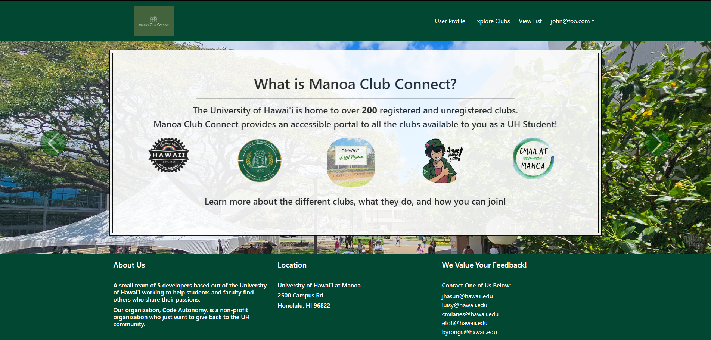

## Introduction
Collaborative software development projects often face challenges with task management, communication, and tracking progress. To address these challenges, the team decided to implement IDPM, a project management approach that focuses on using issues or tasks as the central unit of work. IDPM, which stands for Issue Driven Project Management, was chosen for its simplicity, flexibility, and compatibility with the team's workflow.
   
The link to the organization page can be found [here](https://code-autonomy.github.io/)

## Background
Manoa Club Connect, a web application developed using a stack of Meteor, React, Bootstrap, and MiniMongo, was our collaborative software development project. The application allows users to sign up, create profiles, and join clubs based on their interests. Club organizers can edit their information and post announcements. The team, consisting of Byron, Christian, Eisen, Josh, and myself, adopted an agile approach to development.

## Implementation of IDPM
IDPM was implemented using GitHub projects, which allowed the team to create issues for each task or feature. Each issue was assigned to a team member, who worked on it in a separate branch. This approach helped organize the work, track progress, and resolve conflicts. For instance, a specific example of how IDPM improved task management.

## Individual Contributions
My contributions to the project included:
- Sign-out page styling.
- Admin Edit page.
- Club Removal.
- Addressing various challenges that arose during development.

These tasks required a combination of front-end and back-end skills, as well as collaboration with team members, to ensure consistency and compatibility with the application's overall design and functionality.

## Lessons Learned
The project provided valuable insights into collaborative software development. I learned the importance of effective communication, task prioritization, and time management in a team setting. Through hands-on experience and collaboration with my teammates, I also improved my technical skills, particularly in Meteor, React, and Bootstrap. Some of the challenges we faced included specific challenges, which required specific actions or solutions.

## Impact on Software Development Skills
Working on Manoa Club Connect has significantly enhanced my software development skills. I gained a deeper understanding of web development technologies and best practices, particularly in Meteor, React, and Bootstrap. I also developed a greater appreciation for the importance of teamwork and collaboration in achieving project goals.

## Conclusion
The use of IDPM in the development of Manoa Club Connect was instrumental in the project's success. It helped the team manage tasks, track progress, and collaborate efficiently. The project resulted in a functional web application and provided valuable learning experiences and skills development for all team members.
