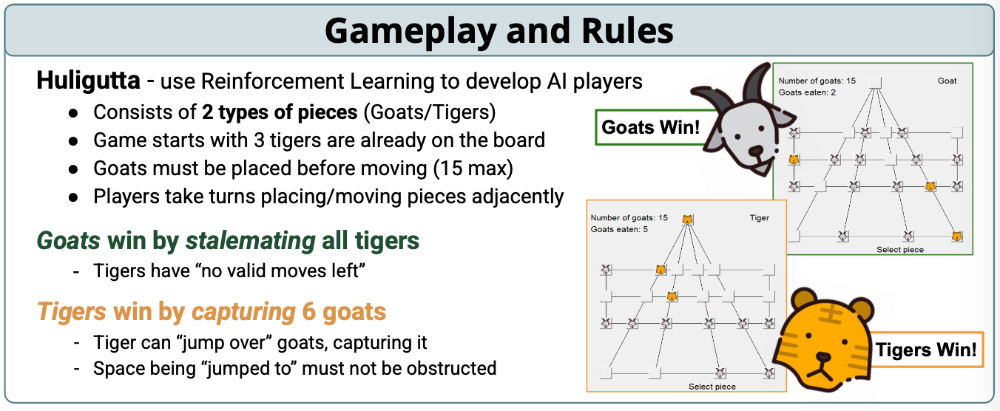
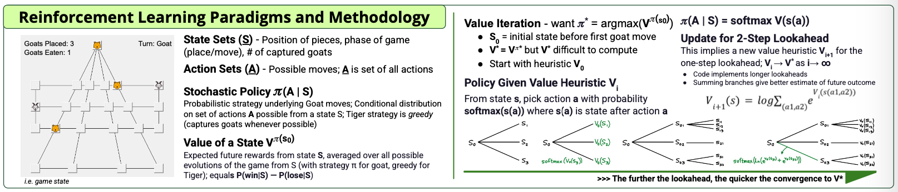

## Intro

  
  
In Game view of Tigers and Goats.

Reinforcement learning (RL) is transforming how machines make decisions, driving innovation in everything from game-playing AIs to autonomous vehicles and energy forecasting. To explore its potential, we began with a classic board game, Huligutta (Goats and Tigers)—a simple yet strategically rich environment. Its clear rules and asymmetric gameplay made it an ideal testbed for developing and evaluating RL models in a controlled setting.

After training an agent that achieved a 95% win rate against fixed strategies, we expanded our focus to more complex and unpredictable challenges: forecasting weather patterns and net energy demand. These real-world problems demand models that can adapt to noisy data, changing conditions, and incomplete information—precisely the scenarios where RL can shine. Leveraging the OpenSpiel API, we developed and refined algorithms capable of operating across both structured games and dynamic forecasting tasks. While our models have shown strong results in the game environment, development in the weather and energy domains remains ongoing, with promising progress expected in the coming semesters.

## Objective

The primary objective was to dramatically improve the Goat player’s performance using value iteration and other RL techniques, achieving a higher win rate than baseline strategies like random or greedy play.

Beyond winning the game, the project aimed to understand how these models could generalize to complex, data-driven systems, specifically weather and power forecasting. This required adapting discrete decision-making strategies from the game to continuous, unpredictable environments with noisy inputs. Scalability, generalization, and adaptability became criteria for this transition.

Additionally, the project served as a hands-on application of prior coursework in machine learning, algorithms, and AI. Tools like the OpenSpiel API allowed us to quickly prototype and evaluate various strategies, forming a bridge between theoretical foundations and practical innovation. Ultimately, the objective was not just to succeed in a game setting, but to build a versatile framework capable of impacting real-world systems such as energy distribution and climate prediction.

## Design Methodology

This project followed an iterative design process to build a reinforcement learning (RL) system capable of mastering the Huligutta game and extending those techniques to real-world forecasting applications. We began by developing a baseline RL model using value iteration, leveraging its efficiency in solving discrete-state problems. To improve long-term strategy and decision-making, we enhanced the model with multi-step lookahead and softmax-based stochastic policies.

Our models were built and tested using the OpenSpiel API, which enabled seamless switching between different RL algorithms (e.g., AlphaZero, MuZero) and provided a fast, modular environment for experimentation. Performance was evaluated through extensive simulation runs and self-play, tracking win rates, convergence behavior, and strategic depth against fixed Tiger strategies.

To expand beyond game environments, we transitioned our methodology to time-series prediction using transformer models. This shift involved integrating real-time data streams, adaptive learning rates, and in-context learning to maintain model stability under dynamic conditions.

Looking forward, our focus includes developing hybrid models that blend deep learning with classical methods like value iteration and incorporating continual learning to support long-term adaptability in forecasting tasks. This structured methodology lays a solid foundation for deploying RL in both strategic games and high-impact real-world systems like weather and power forecasting.

  
  
Summary of RL paradigms and lookahead methodology used in Huligutta and forecasting models.

## Significance and Future Work

While this project began with the strategic board game Huligutta, its broader significance lies in using reinforcement learning (RL) to tackle real-world forecasting challenges. Games provided a controlled environment to refine our models, but the ultimate goal is to apply these strategies to high-impact domains like weather forecasting and energy demand prediction—areas that are dynamic, data-rich, and mission-critical.

One promising direction is the use of transformer models for time-series analysis in weather prediction. Transformers have revolutionized natural language processing and are now showing strong potential for capturing long-range patterns in spatial and temporal data. By leveraging in-context learning, these models can adapt to new regions and weather conditions without extensive retraining—an essential feature for forecasting extreme events like hurricanes or wildfires.

In parallel, we aim to develop RL-based approaches for predicting energy consumption across buildings and campuses. This is particularly relevant for smart grid systems and institutions like the University of Hawaii, which is pursuing a net-zero energy goal by 2035. RL models can respond in real-time to changing usage patterns, unlike static forecasting tools, improving energy efficiency and reducing operational costs.

As we transition to these complex applications, future work will focus on improving model adaptability through continual learning, handling noisy high-dimensional data, and ensuring security through adversarial defense mechanisms. By integrating techniques like experience replay, meta-learning, and gradient-based adaptation, we aim to create models that not only learn but continue learning—robustly, securely, and at scale.

Ultimately, this project lays a foundation for broader AI applications that go beyond games, targeting systems that demand real-time intelligence, adaptability, and resilience.

## Conclusion

This project successfully implemented reinforcement learning (RL) strategies for the Huligutta (Goats and Tigers) game, achieving a 95% win rate against fixed Tiger policies. Through value iteration and stochastic policy approaches, we demonstrated the power of RL in discrete, asymmetric environments—laying a strong foundation for applying these techniques beyond the game board.

By leveraging the OpenSpiel API, we were able to rapidly prototype and experiment with different RL algorithms, creating a flexible and scalable framework. This adaptability will be essential as we move toward more advanced models like AlphaZero and MuZero and begin applying RL to non-game domains.

While the focus began with a strategic board game, the long-term vision is much broader: building intelligent systems that can make real-time, context-aware decisions in dynamic environments. These include high-impact areas like adaptive energy management, smart grid optimization, and predictive maintenance for critical infrastructure.

The next phase of this research will explore transformer-based models for weather forecasting, enabling our systems to generalize across regions and adapt to fast-changing environmental conditions through in-context learning. We will also incorporate continual learning strategies to ensure our models remain robust and reliable over time.

In summary, this project marks a promising step toward developing scalable, intelligent RL systems that perform well in both structured simulations and real-world applications. By applying lessons from Huligutta, we aim to push the boundaries of what AI can achieve across disciplines.

[View Source Code on GitHub](https://github.com/nsanthan/tigersandgoats/tree/fall-24)

## View Full Project Report

<iframe 
  src="../assets/reports/Luis_TandG_report.pdf" 
  width="100%" 
  height="600px" 
  style="border: 1px solid #ccc; border-radius: 8px;">
</iframe>

  If the report doesn't load, <a href="../assets/reports/Luis_TandG_report.pdf" target="_blank">click here to open it in a new tab</a>.

