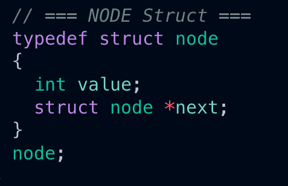
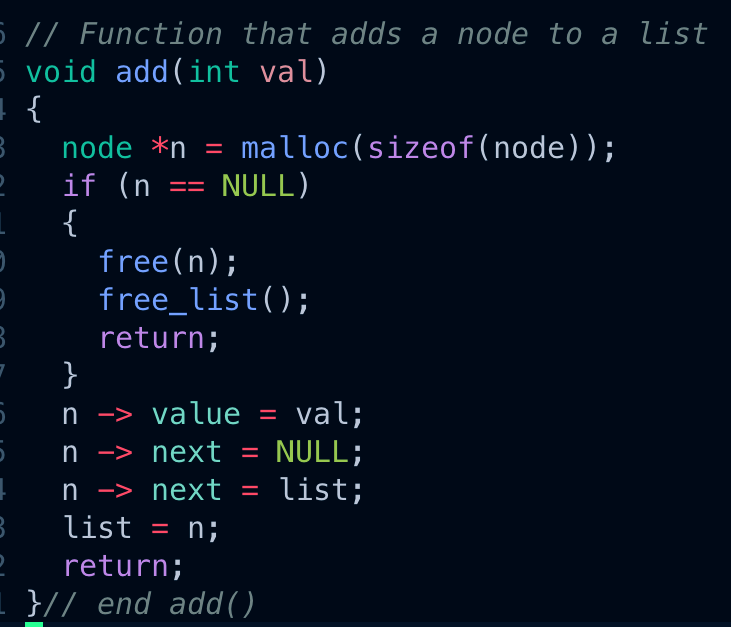
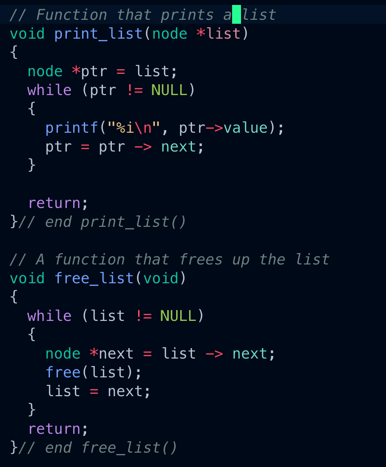

In this coding project, I delve into abstract data types using C, focusing on linked lists. The project's goal is clear: gain a profound understanding of dynamic memory allocation while ensuring the release of every allocated byte.

The foundation is a crafted `node` struct representing each element in our linked list.

We dynamically allocate memory for new nodes through the `add` function, gracefully handling situations where memory allocation may fail.

We traverse the list, print its contents, and ultimately free up the allocated memory in the `free_list` function.

This project serves as a practical exploration of linked lists and a robust exercise in memory management within the confines of C. 
