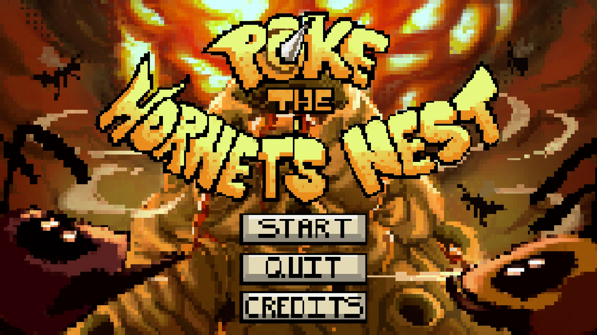
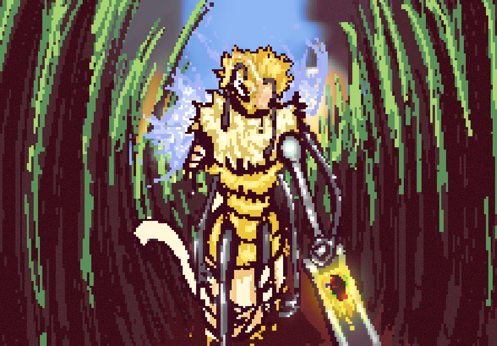
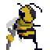

## Intro

  
  
Title screen for Poke the Hornet's Nest.

**Poke the Hornet’s Nest** is a chaotic 2D action-platformer developed by the University of Hawaii at Manoa GameDev Club. You play as **Smoke**, a hardened bee seeking vengeance after hornets destroyed his hive. With only one leg and a supply of bombs, Smoke traverses enemy territory, attaches explosives to hornets, and detonates them for justice and revenge.

## My Contributions

As a **Coding Officer** and core developer, I contributed:

- **Game Over Screen**: Custom logic and scene transition effects.
- **SFX & Music Managers**: Created centralized systems for triggering in-game audio.
- **Extinction Mode**: Designed and implemented endless hornet-wave mode with randomized spawns and kill-triggered easter egg.
- **Cutscenes**: Scripted multi-stage narrative scenes with transitions, camera animations, and fade effects.
- **Character Animation Finalization**: Coordinated with the animation team to ensure sprite animations integrated seamlessly.
- **Script & Easter Egg Writing**: Injected narrative personality, humor, and hidden content into the gameplay.

## Technologies Used

- Unity Engine (2D)
- C#
- Visual Studio
- Git & GitHub

## Project Link

[Play Poke the Hornet’s Nest on itch.io](https://uhmanoagamedev.itch.io/poke-the-hornets-nest)

<iframe frameborder="0" src="https://itch.io/embed/2586996?linkback=true" width="552" height="167"><a href="https://uhmanoagamedev.itch.io/poke-the-hornets-nest">Play Poke the Hornet's Nest on itch.io</a></iframe>

---

## Smoke

  
  
Smoke's ending scene, "Buzzonara"

Smoke is a traumatized last survivor of his bee hive. He uses this to fuel his rage with maniacal-like behavior. His new purpose in life is to watch all hornets blow up. His lines as he kills his enemies just scream of crazy.

“You took my leg—I took your damn life.”  
 “You see that? That’s your doom doing jazz hands.”  
 “No therapy. Just thermite.”

Is Smoke a good guy or a bad guy? …Well, neither. He’s just _done_. He doesn’t fight for honor or survival. He fights because it’s the only thing keeping him from falling apart. His therapy is destruction—specifically, watching hornets burn to ash.

#### Methodology and Mechanics

  
  
Smoke 2D Character Design

Smoke's mechanics revolve around tossing bombs, which causes a recoil that launches him in the opposite direction. For this style, we came up with the idea of **"bee time"** a system where Smoke suspends all movement in midair so he can aim carefully. While holding the fire button, he rotates to aim. Upon release, he shoots and moves simultaneously. Getting this to work was a huge challenge—timing the aiming animation with the actual throw took real precision.

The bullets are slow on purpose. It adds strategy—because Smoke can push his own bullets midair using Unity’s physics system. You can even use the recoil to chase or dodge through enemies depending on how you throw.

#### Extinction Mode

Originally, I designed this mode in case we had issues implementing Smoke's complex movement mechanics. But I saw potential for something more—a late-game bonus mode that zooms in on his completely unhinged state of mind.

In Extinction Mode, Smoke flies and shoots freely. The goal? Annihilate as many hornets as possible before the final cutscene. It’s simpler. It’s faster. But it’s also a character piece. Every three kills, Smoke yells out a new crazy line. It’s not just gameplay—it’s a window into a mind that’s cracked beyond repair and just running on vengeance fumes.

#### A Taste of the Madness

"You buzz, you burn!",
"Boom goes the buzzkill!",
"Sting me once—now you die twice!",
"Pop goes the pest!",
"I hope you enjoyed existing.",
"This ain't revenge. This is ART.",
"I'm painting the sky with hornet guts!",
"My therapist quit. I didn't.",
"Do bees hallucinate? HAHA YES.",
"I licked a wasp once. Regret nothing.",
"Fire is the only music I like now.",
"I saw the queen’s soul leave her thorax.",

---

## Full Credits

### Art Team

- Christian Wall – Art Director, Lead Game Design, Background (Tutorial)
- Hyatt Yoshioka – Queen Wasp Sprite & Animation
- Naia Hoggan – Backgrounds (Level 1 + Boss), Title Screen
- Rachel Tojio – Background (Level 2)
- Rodney Steffany-Looney – Hornet Enemies
- Christopher Oki – Additional UI Assets
- Grake – Cutscene Art
- Lyndon C. – Smoke Sprite & Animation

### Coding Team

- **Luis Hernandez** – Lead Coding Officer, Game Over Screen, SFX/Music Managers, Extinction Mode, Cutscenes, Animation Integration, Script Writing, and more
- Benjamin Bercasio – Senior Programmer, Player Logic, Bomb Physics
- Courtney Hisamoto – Level Integration
- Kyle Bueche – Map Interaction
- Derrick – Tutorial, Boss Phase 1
- Dahyun Kwon – Level 1, Boss Phase 3
- Keita Grant – Level 2, Boss Phase 2
- Coleman Lau – Music Implementation
- Dominic Lau – Bomb Mechanics
- Samantha Limon – Title Screen
- Royce Jarvy Uy – Sound Effects
- Connor Waligur – Enemy Movement
- Dylan Resuello – Bomb Physics
- DJ Houchens – Health System
- Minh Tuan Do – Animation, Credits
- Zhongyu Zhang – Scene Management

### Story & Dialogue

- Zagreus Havoc – Story
- Zoe N. – Story
- Christian Wall – Scenario
- **Luis Hernandez** – Easter Eggs

### Project Management

- Andrew Hoang – Project Manager

### Music & Sound

- Coen Bracilano – Music Director, Audio Lead
- Nathaniel Baybayan – Title & Cutscene Themes, SFX (Smoke’s Death, Queen’s Roar)
- Sebastian Wheelehan – Boss Theme, SFX (Bomb, Damage, Shoot)
- Elwais Golbuu – Main Theme, SFX (Hornet Buzz, Bomb Impact)
