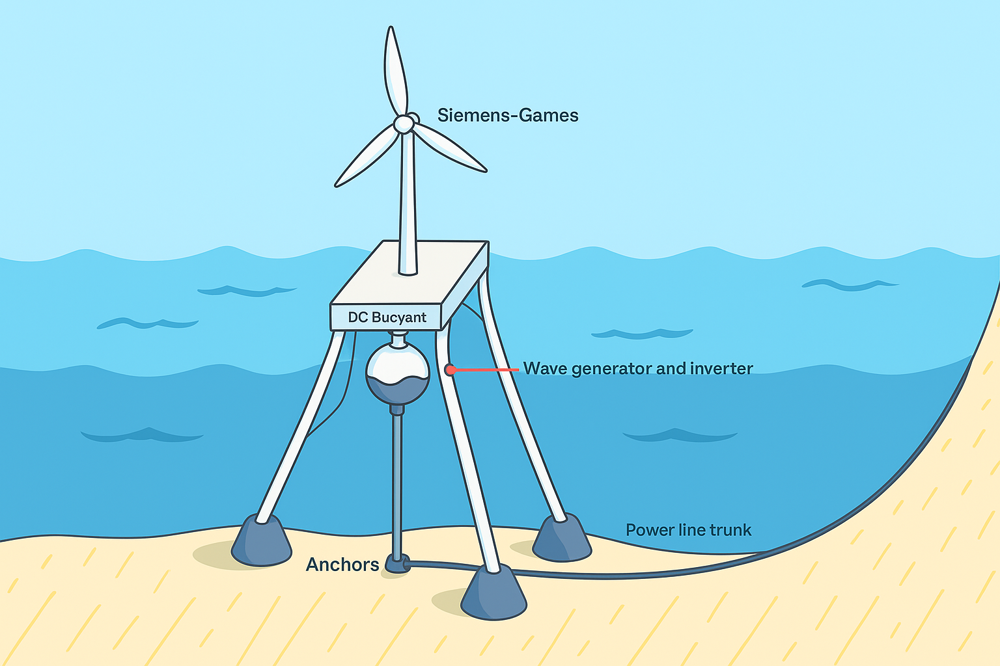

## Intro

  
  
Conceptual Design of Dual Hydro-Wind Offshore Energy Platform. The structure integrates both a floating wind turbine and a wave energy buoy anchored to the seabed. Power from both systems is routed through a combined inverter setup and transmitted via a subsea cable to shore.

## Overview

This senior capstone project presents a hybrid offshore renewable energy system combining Siemens-Gamesa SG 8.0-167 DD wind turbines and CorPower Ocean wave energy buoys. The system is designed to power all 259 Safeway stores in California, each consuming ~1.37 million kWh/year.

## My Role

- Led **cost analysis** and **project duration** estimation for the wind turbine system.
- Conducted **LCOE calculations** for wind using NREL standards.
- Authored sections on **environmental impact** and **global renewable energy challenges**.
- Collaborated on **capacity factor** and **efficiency calculations** for wind turbines.

## Highlights

- **Site**: Humboldt County Offshore (OCS-P0562)
- **Total Annual Energy**: 15.78 TWh (target: 355 GWh)
- **Wind Turbine Capacity Factor**: 61.55%
- **Turbine Efficiency**: 50.45%
- **Estimated Total Cost**: $10.06 Billion USD
- **Total Transmission Losses**: ~21.15%

## Key Technologies

- MATLAB for energy and efficiency modeling
- Research and documentation in IEEE format
- Marine permitting and regulatory review (BOEM, USACE)
- Grid integration and HVDC transmission modeling

## Team

- Byron Soriano, Kaniela Pang, William Young, Luis Hernandez

## View Full Project Report

<iframe 
  src="../assets/reports/FinalProject_ECE438.pdf" 
  width="100%" 
  height="600px" 
  style="border: 1px solid #ccc; border-radius: 8px;">
</iframe>

  If the report doesn't load, <a href="../assets/reports/FinalProject_ECE438.pdf" target="_blank">click here to open it in a new tab</a>.

