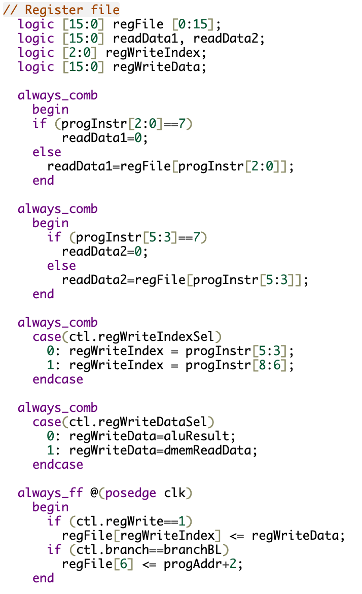
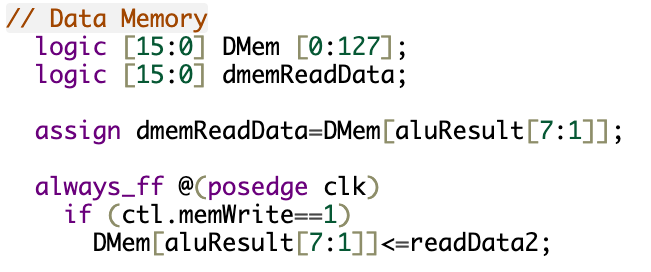
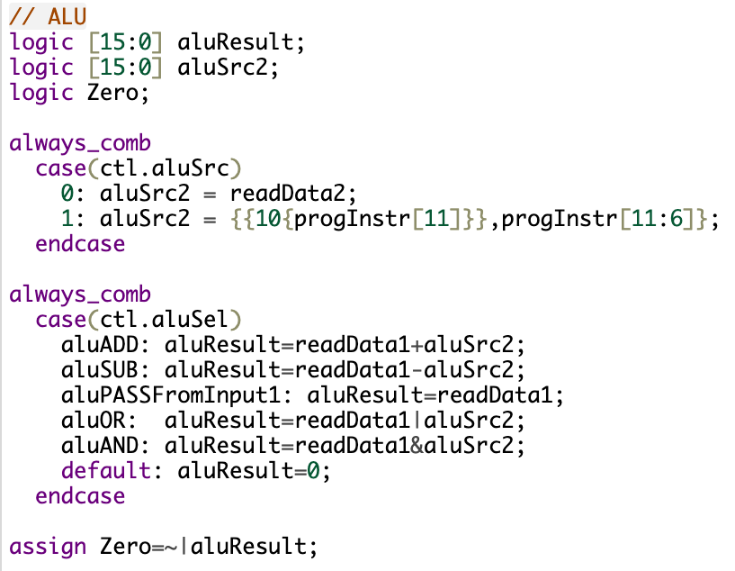
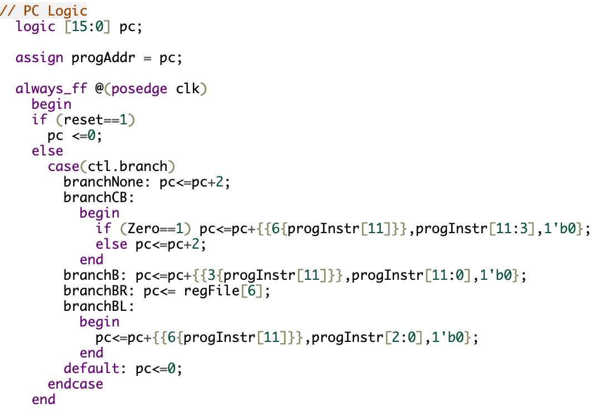
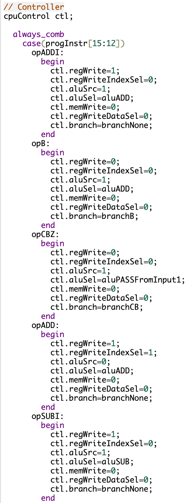

### Simple Processor Design in Verilog

This Verilog project showcases the design of a simple computer module, likely representing a basic processor. The module includes a Register File, Data Memory, Arithmetic Logic Unit (ALU), and PC (Program Counter) Logic. The project is structured to execute instructions based on the provided program instructions.

#### Key Components:

1. **Register File:**
   - Maintains a set of registers (`regFile`) for data storage.
   - Utilizes read and write operations based on control signals.

2. **Data Memory:**
   - Utilizes a data memory array (`DMem`) for storing and retrieving data.
   - Supports memory write operations based on control signals.

3. **ALU (Arithmetic Logic Unit):**
   - Performs arithmetic and logic operations based on control signals.
   - Outputs results to `aluResult` and evaluates a zero condition (`Zero`).

4. **Program Counter Logic:**
   - Manages the program counter (`pc`) based on control signals.
   - Implements branching and program counter updates according to instruction types.
  

5. **Controller:**
   - Implements a `cpuControl` structure to manage control signals for various components.
   - Decodes instruction opcodes to determine control signals.

#### Instruction Set:
The project supports a set of instructions, including additions, subtractions, branches, loads, and stores. Each instruction is associated with specific control signals that guide the processor's behavior.

#### Overall Objective:
This project aims to demonstrate a basic processor design in Verilog, emphasizing the integration of critical components and effective control signal management for executing instructions.
