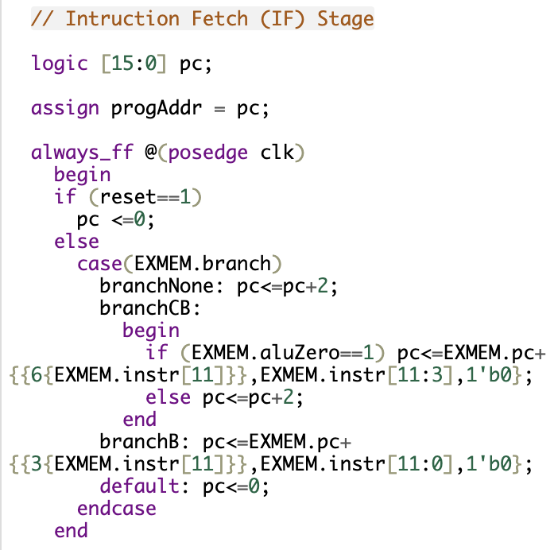
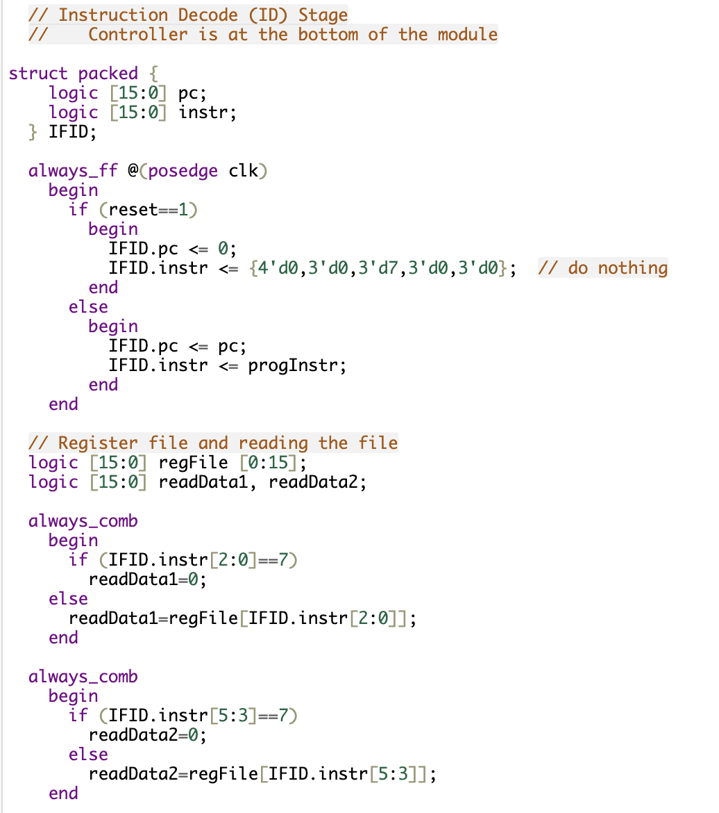
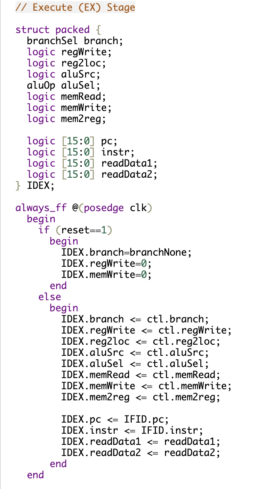
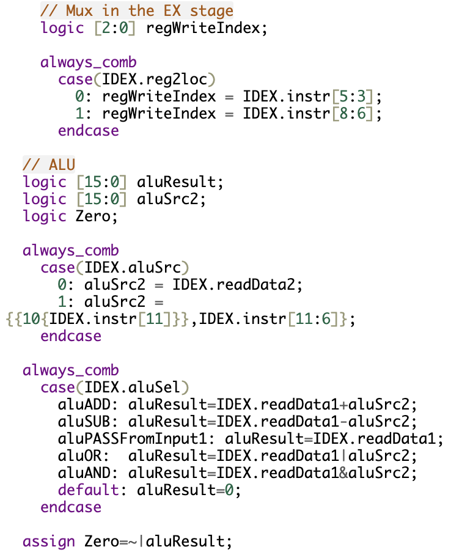
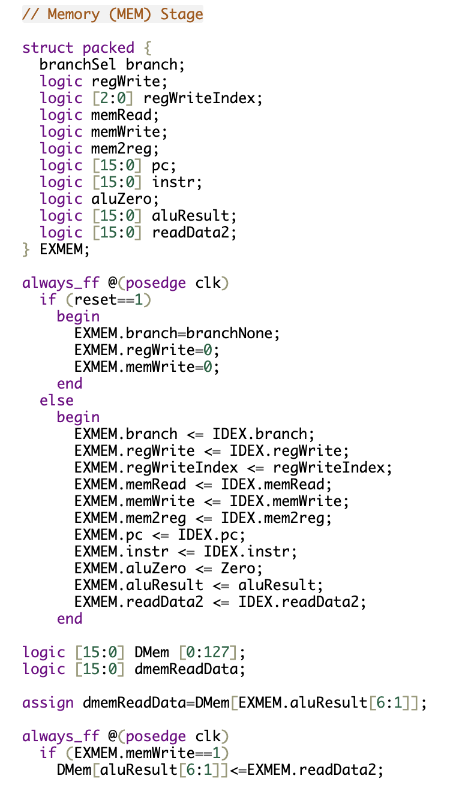
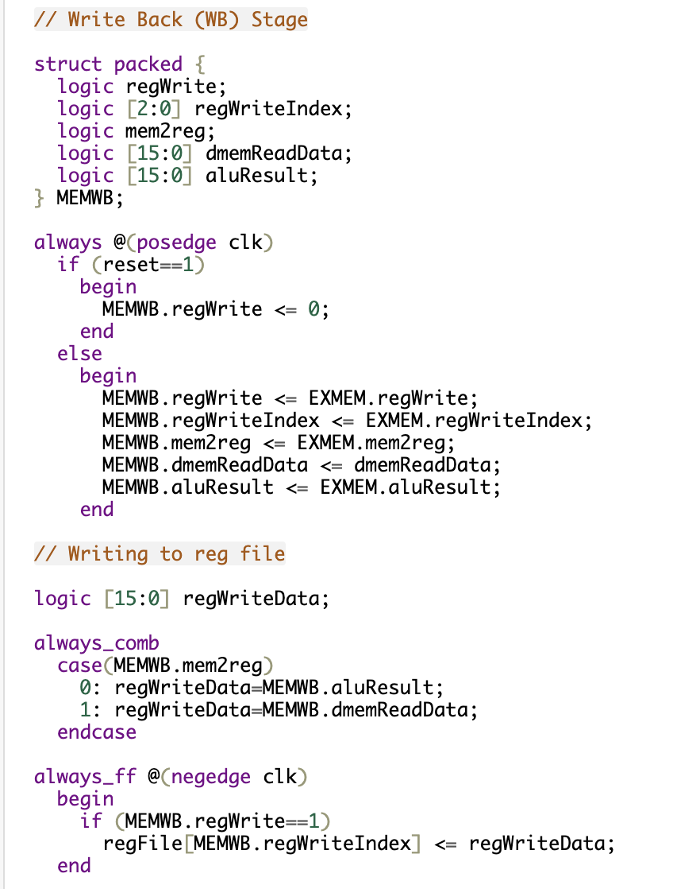
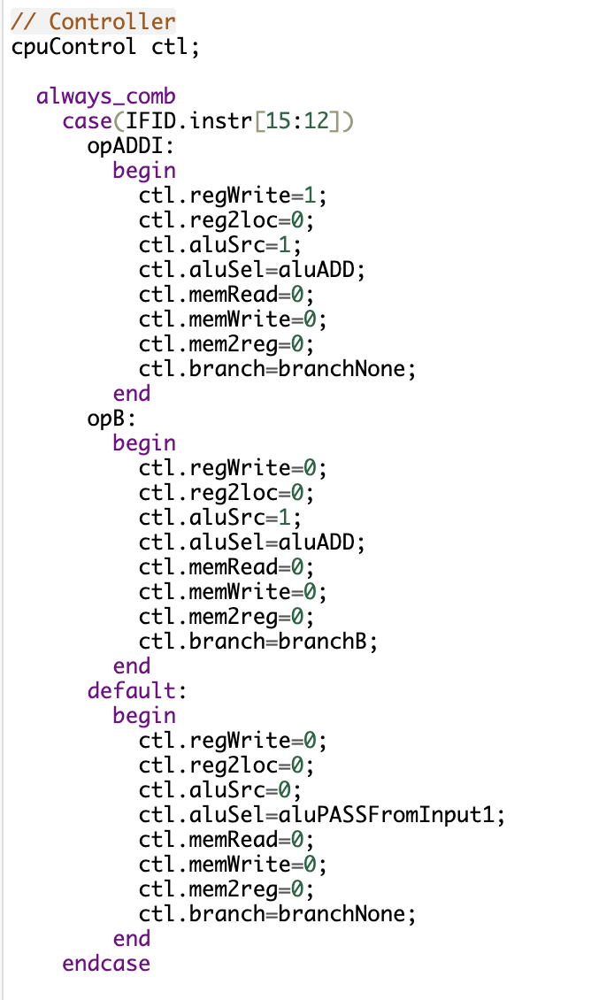

    

    Image credit: <a href="https://www.researchgate.net/profile/Tadi-Chandrasekhar/publication/372100694/figure/fig3/AS:11431281172248033@1688478707679/Pipelined-MIPS-Architecture.ppm" target="_blank">Pipelined MIPS Architecture by Tadi Chandrasekhar</a>

## Simple Processor Design in Verilog

This project's goal is to implement and design a 5-stage pipelined CPU in Verilog. The project is divided into three stages, each building on the previous one to add more complex instruction sets and control logic.

**Stage 0:**  
Lays the foundation by implementing the logic for each pipeline stage, including instruction fetch (IF), instruction decode (ID), execute (EX), memory access (MEM), and write-back (WB). It also includes a basic controller that supports simple instructions like **ADDI** (Add Immediate) and **B** (Unconditional Branch).  
[View Stage 0 on EDA Playground](https://www.edaplayground.com/x/dNZ4)

**Stage 1:**  
Expands the instruction set to include **ADD** (Add), **SUBI** (Subtract Immediate), and **CBZ** (Compare and Branch if Zero), introducing more complex branching logic and enhanced control signal management.  
[View Stage 1 on EDA Playground](https://www.edaplayground.com/x/aijZ)

**Stage 2:**  
Further refines the design with support for **BL** (Branch and Link) and **BR** (Branch to Register), adding subroutine capabilities and more flexible control flow.  
[View Stage 2 on EDA Playground](https://www.edaplayground.com/x/9cb8)

Each stage includes a testbench for verifying functionality and performance, ensuring the processor can handle a wide range of instruction types while maintaining efficient pipeline flow.

## Key Components:

### **Program Counter Logic:**

    

This section of the code implements the **Program Counter (PC)** logic for the **Instruction Fetch (IF)** stage in the pipelined CPU. The PC is responsible for tracking the address of the next instruction to be fetched from memory. It is updated on each clock cycle and plays a critical role in managing the flow of the program.

There are several key components to the **Program Counter Logic**, which are expanded in later stages of the project. However, in this stage, we focus on two main features:

- **Reset Handling:**

  - If the **reset** signal is high, the PC is reset to **0**, restarting the program from the beginning.

- **Branch Handling:**

  - The PC can be updated based on branch instructions, including **B** (Unconditional Branch) and **CBZ** (Compare and Branch if Zero). This allows the CPU to change the execution flow based on the results of prior instructions.

This foundational logic sets the stage for more complex control flow in later stages, including support for subroutine calls and conditional branching.

**Instruction Decode / Register Fetch:**

    

This section of the Verilog code implements the **Instruction Decode (ID) / Register Fetch** stage of the pipelined CPU. It uses a **packed struct** called **IFID** to pass data from the **Instruction Fetch (IF)** stage to the **Instruction Decode (ID)** stage, ensuring that both the program counter (PC) and instruction are treated as a single unit.

#### **Key Features:**

- **Pipeline Register (IFID):**

  - The **IFID** struct holds the 16-bit program counter and 16-bit instruction as the CPU moves from the **IF** stage to the **ID** stage.
  - This separation allows the instruction and PC to be latched together, reducing signal overhead and improving efficiency.

- **Zero Register Handling:**

  - This is a feature of RISC architectures like MIPS, where a specific register is hardwired to **0** for convenience.
  - If the instruction attempts to read from the zero register, the output is forced to **0** to prevent unintended data corruption.
  - This approach simplifies instruction encoding and reduces the risk of programming errors.

- **16-Entry Register File:**

  - The CPU uses a 16-entry register file for temporary data storage and retrieval.
  - The register file outputs two values, **readData1** and **readData2**, based on the instruction fields.

This stage is crucial for ensuring efficient data flow through the pipeline, setting the stage for ALU operations and branching in later stages.

### **Execution and Address Calculation**

    

This part of the code implements the **IDEX** pipeline register, which is responsible for holding the control signals and data as they pass from the **Instruction Decode (ID)** stage to the **Execute (EX)** stage. This is where the actual computation happens, including ALU operations and branching decisions.

The **IDEX** register captures critical control signals like **branch**, **regWrite**, **aluSrc**, and **aluSel**, along with the current **program counter (pc)**, **instruction (instr)**, and **operand data (readData1, readData2)**. It ensures that all necessary information is available for the ALU and other components to make accurate calculations.

---

    

This part of the execute stage handles two critical components: the **MUX** for register index selection and the **ALU (Arithmetic Logic Unit)**. These components are responsible for selecting the destination register, preparing the ALU operands, and performing the actual computation.

#### **Key Components:**

- **Register Index MUX:**

  - Selects the destination register for write-back based on the **reg2loc** control signal.
  - Allows for flexible data routing in the ALU.

- **ALU Operand MUX:**

  - Chooses between a register value and an immediate value based on the **aluSrc** control signal.
  - Supports sign-extension for immediate values.

- **ALU Operations:**

  - Handles a wide range of arithmetic and logical operations, including **ADD**, **SUB**, **OR**, **AND**, and **PASS**.

- **Zero Detection:**

  - Sets the **Zero** flag if the ALU result is zero, enabling conditional branching.

Together, these components form the core of the EX stage, ensuring that the CPU can efficiently execute a wide range of instructions with minimal delay.

### **Memory Access (MEM)**

    

This section of the code implements the **Memory (MEM)** stage of the pipelined CPU. It includes the **EXMEM** pipeline register, the main data memory, and the logic for reading and writing data during this stage. This is where the CPU interacts with data memory, loading values from or storing values to memory based on the instruction type.

#### **Key Features:**

- **Efficient Data Storage:**

  - Uses a 128-word memory array to store and retrieve 16-bit data efficiently.

- **Hazard Management:**

  - Prevents unintended writes on reset, reducing the risk of data corruption.

- **Flexible Addressing:**

  - Supports both register-based and immediate-based addressing for flexible data access.

- **Pipeline Isolation:**

  - Keeps control and data signals isolated as they move through the pipeline, reducing timing mismatches and data hazards.

#### **Core Components:**

- **EXMEM Pipeline Register:**

  - Holds the control signals and data needed for the MEM stage, including ALU results, memory control signals, and register write information.

- **Data Memory (DMem):**

  - The primary storage for program data, supporting both read and write operations.

- **Memory Read and Write Logic:**

  - Efficiently manages data movement between the CPU and memory, supporting various instruction types like **LD** (Load) and **ST** (Store).

Together, these components form the backbone of the MEM stage, ensuring efficient data handling and memory access for the pipelined CPU.

### **Write Back (WB)**

    

This part of the code implements the **Write Back (WB)** stage of the pipelined CPU. This is the final stage of the pipeline, where the results of computations or memory reads are written back to the register file, completing the instruction execution cycle.

### **Key Features of the WB Stage:**

- **Efficient Data Handling:**

  - Flexibly handles both ALU results and memory data, ensuring the correct value is written back to the correct register.

- **Hazard Prevention:**

  - Prevents unintended writes by disabling **regWrite** on reset, reducing the risk of data corruption.

- **Simple Control Logic:**

  - The **mem2reg** signal provides a straightforward way to select between ALU and memory data, reducing the complexity of the control logic.

- **Low Latency:**

  - The use of packed structs reduces data propagation delays, improving overall CPU performance and synchronization.

Together, these features ensure that the **WB** stage completes the final step of instruction execution efficiently, supporting a wide range of instruction types while minimizing data hazards.

### **Controller**

    

This section of the code implements the **Controller** for the CPU, which is responsible for generating the control signals that guide the operation of each pipeline stage. It uses a **case** statement to decode the opcode of the current instruction and set the appropriate control signals accordingly.

### **Key Features of the Controller:**

- **Efficient Instruction Decoding:**

  - Quickly maps opcodes to control signals, reducing the time needed for instruction decoding.

- **Flexible Control:**

  - Supports a wide range of instructions, from simple arithmetic to complex branching.

- **Error Handling:**

  - Provides a default case to prevent unintended operations on unrecognized instructions, ensuring the CPU remains stable even with unexpected inputs.

- **Pipeline Integration:**

  - Feeds control signals into the **IDEX** pipeline register, ensuring consistent instruction execution across stages and minimizing data hazards.

Together, these features make the controller a critical part of the CPU, allowing it to efficiently decode and execute a wide range of instruction types.

## **Supported Instructions**

| Instruction | Opcode | Description                |
| ----------- | ------ | -------------------------- |
| **ADD**     | 0      | Register addition          |
| **SUB**     | 1      | Register subtraction       |
| **B**       | 2      | Unconditional branch       |
| **LD**      | 3      | Load from memory           |
| **ST**      | 4      | Store to memory            |
| **CBZ**     | 5      | Compare and branch if zero |
| **ADDI**    | 6      | Add immediate              |
| **ANDI**    | 7      | AND immediate              |
| **SUBI**    | 8      | Subtract immediate         |
| **BL**      | 9      | Branch and link            |
| **BR**      | 10     | Branch to register         |

This CPU supports a range of basic instructions, including arithmetic, logical, memory access, and control flow operations. These instructions form the core functionality of the processor, allowing it to perform a wide variety of tasks.

### **Instruction Categories:**

- **Arithmetic Operations:**

  - **ADD, SUB, ADDI, SUBI, ANDI**
  - Perform basic math and logic operations, forming the core of most computations.

- **Memory Operations:**

  - **LD, ST**
  - Enable data transfer between the CPU and memory, supporting both load and store operations.

- **Control Flow Operations:**

  - **B, CBZ, BL, BR**
  - Provide branching capabilities, including both conditional and unconditional jumps, as well as function calls.

### **Key Features:**

- **Immediate and Register-Based Operations:**

  - Supports both immediate values and register-based operands, providing flexibility in instruction encoding.

- **Efficient Memory Access:**

  - Separate instructions for loading and storing data, optimizing data flow within the CPU.

- **Branch Control:**

  - Multiple branching options, including absolute and relative jumps, as well as link register support for function calls.

These instructions are the building blocks for implementing more complex algorithms and programs, making this CPU versatile for a wide range of applications and a great learning tool.
